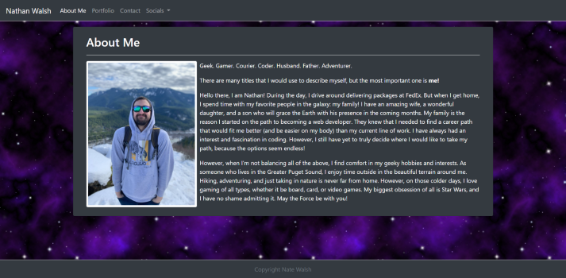
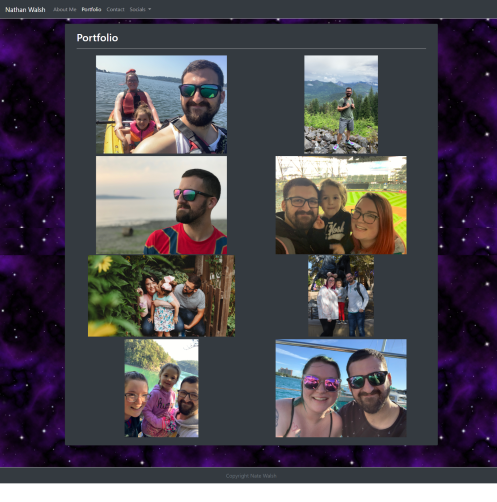
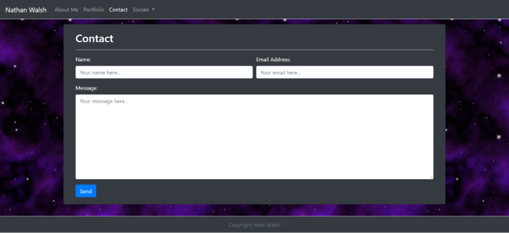

# Personal Portfolio
## A responsive and functional web application using Bootstrap framework

> The main goal when creating this repo was to create a web application that would be responsive amongst a wide variety of devices. By utilizing Bootstrap and it's components, this web application accomplishes that goal   
---
## [Link to GitHub deployment](https://nathanjamis.github.io/Portfolio/)
---
### Screenshots of deployed repo

---
Short GIF demonstrating responsiveness

---
